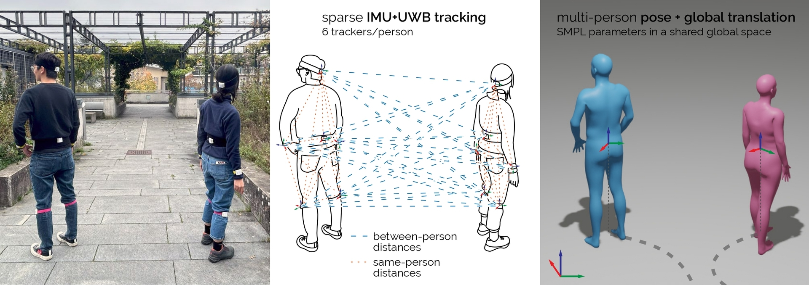

# Group Inertial Poser (ICCV 2025)

### Multi-Person Pose and Global Translation from Sparse Inertial Sensors and Ultra-Wideband Ranging

[**Project Page**](https://siplab.org/projects/GroupInertialPoser) | [**Paper**](https://arxiv.org/abs/2510.21654) | [**Dataset (GIP-DB)**](#dataset)

[Ying Xue](), [Jiaxi Jiang](https://jiaxi-jiang.com/), [Rayan Armani](https://www.rayanarmani.com/about), [Dominik Hollidt](), [Yi-Chi Liao](), [Christian Holz](https://www.christianholz.net)  
**Sensing, Interaction & Perception Lab, ETH Zürich**


## 📌 Overview
**Group Inertial Poser (GIP)** estimates 3D full-body poses and global translation for multiple humans using inertial measurements from a sparse set of wearable sensors, augmented by the distances between the sensors via ultra-wideband (UWB) ranging. 

By leveraging inter-sensor distances across multiple people, GIP overcomes the inherent translation drift of purely inertial systems. Our method preserves meaningful interaction dynamics and stabilizes global trajectories through a novel structured state-space model (SSM) and a two-step optimization pipeline.

<p align="center">

</p>

### Key Features
* **Drift-Free Tracking:** Uses UWB ranging to anchor inertial measurements in a global context.
* **Multi-Person Coordination:** Leverages cross-body sensor distances to refine relative positioning.
* **State-Space Models:** Utilizes SSMs to integrate temporal motion patterns for precise pose estimation.
* **GIP-DB Dataset:** The first IMU+UWB dataset for two-person tracking (200 mins, 14 participants).


---

## 🛠 Installation

### 1. Environment Setup
```bash
conda create --name GIP python=3.9 -y
conda activate GIP

# Install core dependencies
python -m pip install torch torchvision torchaudio chumpy vctoolkit open3d pybullet qpsolvers cvxopt prettytable tensorboard qpsolvers\[quadprog\] cython wandb cmake pytorch_lightning pykeops einops numpy==1.23.5

```

### 2. Libraries & Models
1. **RBDL**: Install the modified Rigid Body Dynamics Library [rbdl](https://github.com/rbdl/rbdl) from [RBDL-PIP](https://github.com/XueYing126/RBDL-PIP).

2. **SMPL Models**: Download [SMPL](https://smpl.is.tue.mpg.de/) model: version 1.0.0 for Python 2.7 (female/male. 10 shape PCs) (unzip and obtain `basicmodel_m_lbs_10_207_0_v1.0.0.pkl`) and place it in the `./data` folder.

3. **S4 Model**: Download the S4 repository [here](https://github.com/state-spaces/s4/tree/main) and move the `models/` folder into your project's root directory (`./`).


## 🚀 Getting Started

###  Data Preparation
<!-- 1. **Interhuman Dataset**: Download the dataset from [here](https://drive.google.com/drive/folders/1oyozJ4E7Sqgsr7Q747Na35tWo5CjNYk3) and place into the folder `data/interhuman`.


2. **Preprocessing**:

```Bash

python modules/dataset/preprocess.py
``` -->

1. **Interhuman Dataset**: Download the preprocessed Interhuman dataset from [here](https://drive.google.com/drive/folders/1mRtHkGrgjZUYEesZBd8PW2ZxYn8C-6cV?usp=sharing) and place into the folder `data/processed_data/`. Please note that by downloading the preprocessed datasets you agree to the same license conditions as for the Interhuman dataset (https://tr3e.github.io/intergen-page/). You may only use the data for scientific purposes and cite the corresponding papers.

2. **Pre-trained Weights**: Download the GIP [Weights](https://drive.google.com/file/d/1yjzYCBn-sY4Ce9oKyVVL2n0o8qoiFRsl/view?usp=sharing) and place them in your checkpoint directory.

### Evaluation

To run the evaluation on the Interhuman dataset:

```Bash

python modules/evaluate/evaluator_interhuman.py --network SSM \
      --ckpt_path /path/to/model.pt \
      --data_dir data/processed_data/interhuman_test/test \
      --eval_trans \
      --normalize_uwb \
      --add_guassian_noise \
      --model_args_file config/model_args.json \
      --eval_save_dir Eval_Interhuman --exp_name ssm_eval --device cuda:0
```

### Training

We follow a phased training approach. Ensure [AMASS](https://amass.is.tue.mpg.de/index.html) is downloaded and preprocessed, and paths are configured in config/config.py.

```Bash

python Train_model.py --pretrain_model '' \
      --config_file "config/train_config.ini" \
      --log_dir "output/ssm_model" \
      --network SSM \
      --training_phase baseline_gnn_jp_mapper baseline_rnn_jp_mapper baseline_rnn3 baseline_rnn4 baseline_rnn5 \
      --eval_dataset "interhuman" \
      --device cuda:0
```

## 📊 Dataset (GIP-DB)
Download the dataset from [here](https://drive.google.com/drive/folders/12XM1rB2hlYHRXuOSPrX5di3WNynthVvR?usp=sharing) and place it into the folder `data/processed_data/GIP-DB/`.


## 📝 Citation

If you find our paper or code useful, please cite our work:

    @inproceedings{xue2025groupinertialposer,
      author    = {Xue, Ying and Jiang, Jiaxi and Armani, Rayan and Hollidt, Dominik and Liao, Yi-Chi and Holz, Christian},
      title     = {{Group Inertial Poser}: Multi-Person Pose and Global Translation from Sparse Inertial Sensors and Ultra-Wideband Ranging},
      booktitle = {Proceedings of the IEEE/CVF International Conference on Computer Vision (ICCV)},
      pages     = {24910--24921},
      year      = {2025},
      publisher = {IEEE},
      address   = {New Orleans, LA, USA},
      doi       = {10.48550/arXiv.2510.21654},
      url       = {https://arxiv.org/abs/2510.21654},
      keywords  = {Human pose estimation, IMU, UWB, multi-person tracking, global translation},
      month     = oct
      }


License and Acknowledgement
----------
This project is released under the **MIT license**. Our code is partially based on [PIP](https://github.com/Xinyu-Yi/PIP) and [UIP](https://github.com/eth-siplab/UltraInertialPoser).
